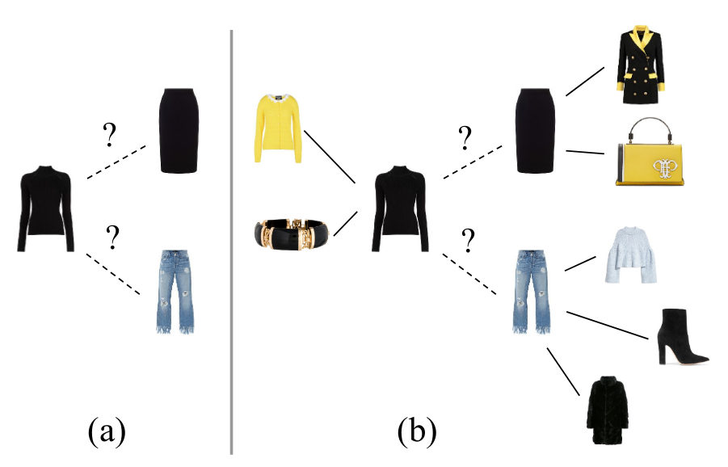

# Context-Aware Visual Compatibility Prediction

  

In this repository we provide the implementation for the paper [Context-Aware Visual Compatibility Prediction](https://arxiv.org/abs/1902.03646). We propose a method that predicts compatibility between two items based on their visual features, as well as their context. We define context as the products that are known to be compatible with each of these items. Our model is in contrast to other metric learning approaches that rely on pairwise comparisons between item features alone. We address the compatibility prediction problem using a graph neural network that learns to generate product embeddings conditioned on their context. 

## Requirements

The model is implemented with Tensorflow. All necessary libraries can be installed with:

    pip install -r requirements.txt

## Data

### Polyvore
The [Polyvore dataset](https://github.com/xthan/polyvore-dataset) can be automatically downloaded by running the following script in `data/`:

    ./get_polyvore.sh
    
**Note:** Expect this to take a while, it has to download about 12 GB and then decompress it.

When all files are downloaded, run `./process_polyvore.sh` in `data/polyvore/`which will extract image features and create the necessary files.

### Amazon
To download the Amazon dataset, [contact the authors](http://jmcauley.ucsd.edu/data/amazon/index.html) of the dataset. Then, download the metadata and image features files for the *Clothing, Shoes and Jewelry* category, and place them in `data/amazon/`.

Finally, process the dataset to generate needed files by running `prepare_dataset.sh` in `data/amazon/`.

## Training
The model is trained with the following command:

    python train.py -d DATASET

The most relevant arguments are the following:

 - `-d DATASET`: Choose from `(fashiongen, polyvore, amazon)`
 - `-lr LR`: Learning rate. `0.001` by  default.
 - `-hi N N N`: One argument per layer that defines the number of hidden units in that layer. Default: `-hi 350 350 350`
 - `-deg D`: Size of the neighbourhood used around each node. Default `1`.
 
 For the amazon dataset, the subcategory used is selected with:
 
 - `-amzd NAME`: Which can be one from `(Men_also_bought, Women_also_bought, Women_bought_together, Men_bought_together)`
 
 For example, to train a model like the one described in the paper for the Polyvore dataset, run:
 
    python train.py -d polyvore

Which will store the log and the weights of the model in `logs/`.

## Evaluation:
A model trained on Polyvore or FashionGen can be evaluated for the FITB task and the Compatibility prediction task.
Evaluation for the FITB task is performed with:

    python test_fitb.py -lf PATH_TO_MODEL -k K

and for the compatibility task with:

    python test_compatibility.py -lf PATH_TO_MODEL -k K

In both cases, K is the maximum number of neighbours used around a node. For Polyvore, the flag `--resampled` can be set to use the resampled version of the task, which is harder.

## Reference
Please cite our paper as:

    @InProceedings{Cucurull_2019_CVPR,
      author = {Cucurull, Guillem and Taslakian, Perouz and Vazquez, David},
      title = {Context-Aware Visual Compatibility Prediction},
      booktitle = {The IEEE Conference on Computer Vision and Pattern Recognition (CVPR)},
      month = {June},
      year = {2019}
    }

## License
`MIT`
